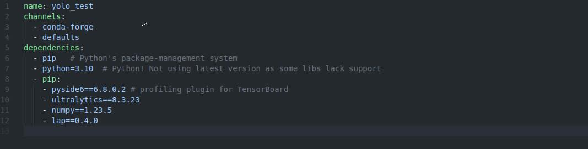
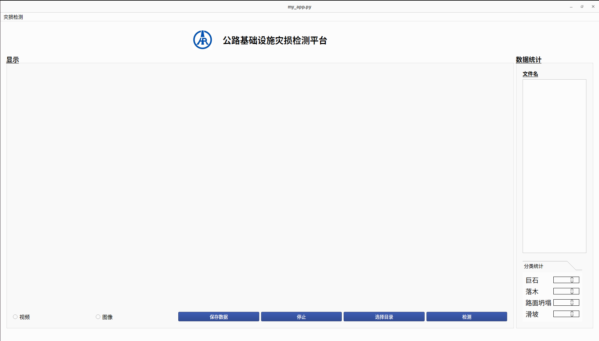

**软件安装拉取说明：**

1. 激活环境指令:  
    环境名称为**env.yml**中name所对应名称  

      

    如图环境名为 yolo_test
    运行 `conda activate yolo_test`

2. 运行app
进入项目文件夹， `cd 'path to project'`， `'path to project'` 为系统中的路径名  
输入 `python my_app.py`

3. 拉取更新最新代码
在项目所在文件夹中右键点击 git bash
输入指令 `git restore . && git pull`
该指令会重置之前所有操作并拉取最新代码，如有代码需要备份请与我联系

4. ui样例
